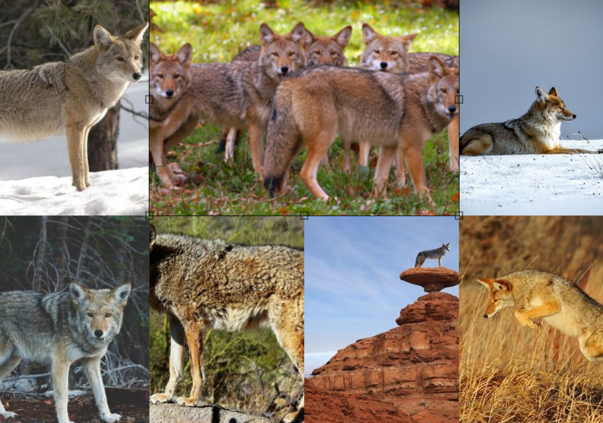
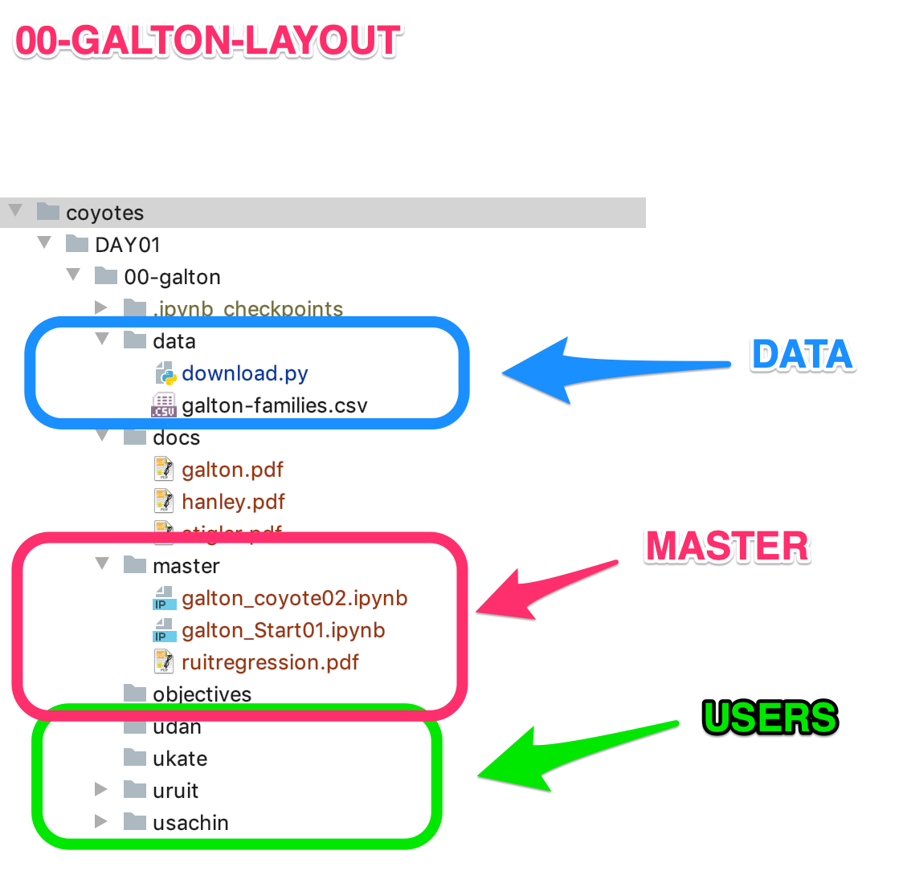

# COYOTES - 100 DATASET
> Collection of R and Python notebooks for 100 dataset bootcamp.

# Goals:
- Arrive fresh Saturday morning
- Solve 10 datasets
- Present in the evening
- Collaborate during the week to finish assignments
- Repeat next 10 weekends...
  
# Objectives
- Work together as team
- Help each other
- Learn, Educate and Have Fun...

## Release History

* 0.0.1
    * Work in progress

[GITHUB - Team Coyotes](https://github.com/supportvectors/100datasets/tree/master/contrib/coyotes/)

## Members and Expertise:

## Python - Team  
    Dan
    Ben
    Kate
    Sachin

## R - Team
    Ruit
    Sudhir
    Sachin (Partial)

## Overall Logistics  
    Sachin - GIT, Manage DataSets, Curate Notebooks 
   
## Saturday Drills
- #### Discuss DataSets/Objectives/Roles/Deliverables - Limit to 30 mins
- #### Create task lists with clear responsibilities/deliverables
- #### Members form teams of one and two and self assign tasks
- #### Create DAY folder for DAYXX
- #### Since there are ten sessions we should have DAY01, DAY02..etc till DAY10
    Layout for DAY01 is shown below

    

- #### Create DATASET folder under DAYXX folder
    DAY00 contains galton, smiley, bowtie....mnist and fnist datasets.  
    So DAY00 will contain the folders 00-galton, 01-smiley and so on...  
    Sample layout of the 00-galton is shown below...
    
    

- #### Layout of the DataSet Folder
    |FOLDER | PURPOSE|
    |:----- | :----|
    |`data` | Must contain script called `download.py`. This script can be run to download the dataset to your local laptop. **CAUTION: Please don't push datasets back to github. Large datasets will cause git to fail.**|
    |`docs`|All papers and articles that are collected to understand the dataset|
    |`master`|Fully functional R and Python notebooks that will be used during final resentation. Tbis notebook should contain commentary and answer the objectives|
    |`objectives`|Detail list of objectives and assigned owner list. This list could be worked on during the week to complete the assignment. Members from within our team or outside team are welcome to help us complete the tasks.|
    |`uuserid`|Owner specific directory/folders. Users are create their snippets of workbooks and use this directory for collaboration. Avoid adding redundant information or making private copy of the data. Use data from the data folder. Example of directories for dan, kate and sachin
    |`usachin`|Directory for sachin. Contents can be free format. Left to user. |
    |`ukate`|Directory for kate. Contents can be free format. Left to user|
    |`udan`|Directory for Dan. Can contain R notebooks, commentary etc|
  
## GIT WORKFLOW AND PRIMER

|Command|Purpose|
|:---|:---|
|`git clone <repo>`|Make of copy of the git repository|
|`git status`|Get status of the local changes|
|`git add <folder/file>` |Add a folder or file to be committed|
|`git commit -m Message`|Brief message for commit|
|`git push`|Push changes to git|
|`git pull`|Pull new changes from git|
|`git checkout -b <branch>`|Checkout a branch. We will use master branch for this project|

[Git Cheat Sheet:](./team/github-git-cheat-sheet.pdf)

## Questions

Send an email:  
[email: Sachin Naik](<mailto:sachin.u.naik@gmail.com>)

## Join Support Vectors Slack Group  
[Support Vectors Slack Group](<http://supportvectors-hq.slack.com>)

## Contribute to Maintain this Page
[Markdown Cheat Sheet](<https://guides.github.com/features/mastering-markdown>)

